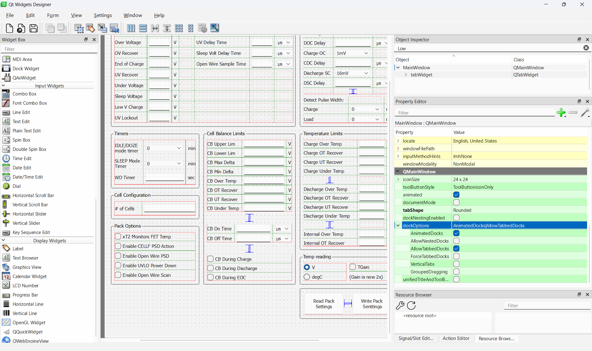

# FMCW App

GUI was developed using the Qt Designer available in the PySide6 package. 

run on terminal: `pyside6-designer`

The design will generate a `.ui `file which is loaded directly in the `main.py`. For more details, check [here](https://doc.qt.io/qtforpython-6/tutorials/basictutorial/uifiles.html#tutorial-uifiles).

